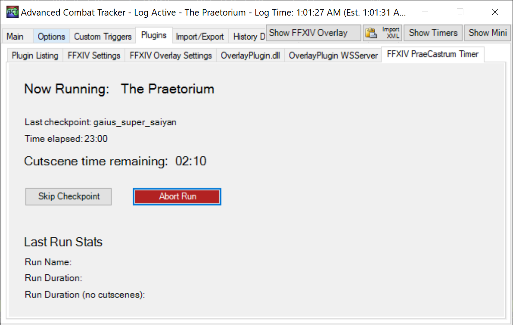

# FFXIV PraeCastrum Timer
An Advanced Combat Tracker (ACT) Plugin to show how much time is left in FFXIV Castrum/Praetorium cutscenes.

## Why?

Since Castrum and Praetorium are full of long, unskippable cutscenes, I'll often tab out to do other things when they start playing. However, to make sure I catch when the cutscene ends, I'll often tab back in to check the cutscene progress. I found this really annoying, so this plugin aims to remove the need for that. It parses ACT messages to detect when a cutscene begins, and shows a timer counting down to when the cutscene ends.

    

Only english game clients are supported at this time.

## Installation

See the [releases page](https://github.com/Ricimon/FFXIV_PraeCastrum_Timer/releases) for download archives.

installation instructions *coming soon*

## Usage

In ACT, navigate to the **Plugins** tab and click on the **FFXIV PraeCastrum Timer** tab. Timers will appear here when the plugin detects a run has been started.

## Coming Soon™

- *Play a sound when a cutscene is almost over*
- *In-game timer overlay*
- *Accurate timers for non-english VO*

## License

MIT License. See [License](LICENSE) for details.
